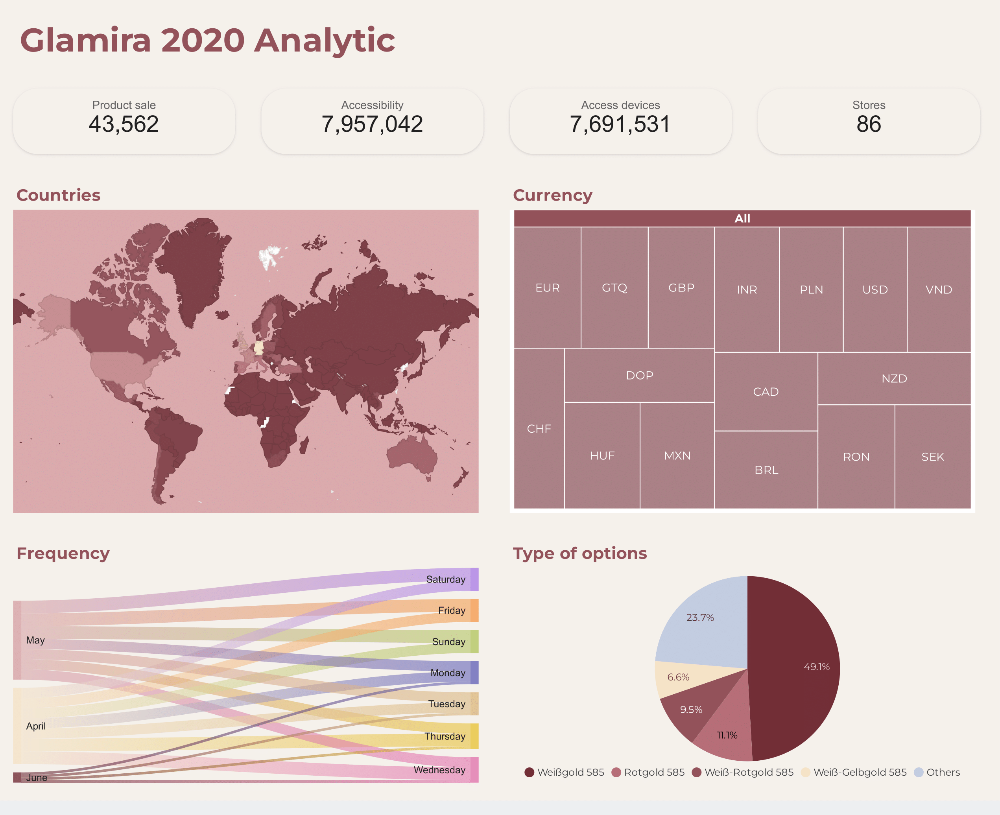

# 🪙 Unigap DBT Project

## 📌 Overview
This project builds a modern data pipeline for **Glamira e-commerce data (44M records)** using DBT, **Google Cloud Storage (GCS)**, and **Looker**.  
It transforms raw data into analytics-ready models for reporting and insights.

## 🔗 Data Flow
1. **Source**: Raw data from **Glamira** stored in **Google Cloud Storage (GCS)**.  
2. **Transformations**: Performed in **dbt**:
   - **Staging models**: Clean and standardize raw data.
   - **Dimensions**: Define business entities (e.g., customers, products).
   - **Facts**: Capture business events (e.g., orders, payments).
   - **Marts**: Curated data for analytics & dashboards.
3. **Analytics**: Exposed in **Looker** for visualization and reporting.

## 📂 Project Structure

```bash
.
├── analyses/             # ad-hoc queries
├── macros/               # reusable dbt macros
├── models/               # dbt models
│   ├── staging/          # staging layer (raw → clean)
│   ├── dimensions/       # dimension tables
│   ├── facts/            # fact tables
│   └── marts/            # curated marts for BI
├── seeds/                # static CSV seed data
├── snapshots/            # slowly changing dimensions
├── tests/                # dbt tests
├── target/               # compiled SQL (ignored in git)
├── dbt_project.yml       # dbt project config
└── README.md             # project documentation
```

🚀 Getting Started
1. Install Dependencies
# Install dbt (example with BigQuery adapter)
pip install dbt-bigquery

3. Run dbt Models
# Test connection
dbt debug

# Run staging models
dbt run --select staging

# Run all models
dbt run

4. Visualize in Looker


📊 Data Volumes

Source: 44 million records from Glamira.

Optimized with dbt incremental models for scalability.

⚙️ Best Practices

Use incremental models for large tables to reduce runtime.

Apply dbt tests for data quality (unique, not null, referential integrity).

Leverage snapshots for tracking historical changes (SCD).

Modularize SQL logic with macros.
